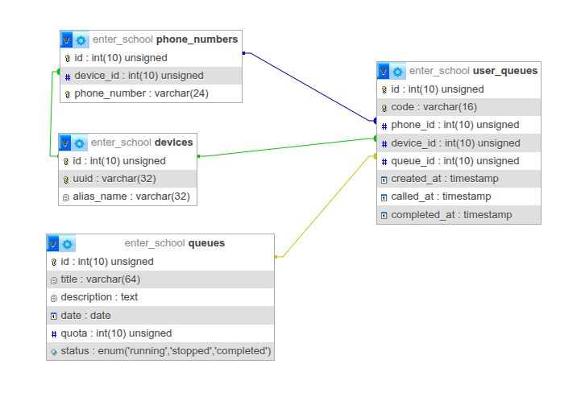

# Enter School

Manajamen antrean untuk pendaftaran sekolah.

## ERD

## Features
- Normal User :
  - [x] Tanpa login, bisa langsung pakai app.
  - [x] Ambil Antrean (`Queue`) dengan nomor telepon (`Phone Number`).
  - [x] Lihat semua `Queue` yang telah diambil suatu Perangkat (`Device`) serta `Phone Number` nya.
  - [x] Lihat Detail `Queue` yang telah didaftar.
- Admin
  - [x] CRUD `Queue`.
  - [x] Menjalankan suatu `Queue`.
    - [x] Memanggil user yang mendaftar suatu `Queue`, pemanggilan bisa tidak berurutan (misal, pemanggilannya: no 1, 2, 5, 8, 3, 9, 6, ...).
    - [x] Update status `Queue` (Berjalan, Dijeda, atau Selesai)
    - [x] Menyelesaikan suatu `Queue` (jika semua user telah dipanggil).

## Extra Features
- [x] Sebuah `Device` dapat menyimpan banyak `Phone Number` berdasarkan `uuid` pada perangkat user yang digenerate dengan `FingerprintJS`.